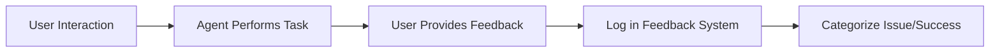

# Agent Improvement Tracking System

## Overview
This system tracks agent performance, collects feedback, and manages continuous improvement of all Agent Force specialists.

## Feedback Collection

### 1. Agent Performance Log
Each agent interaction should be logged with:
```yaml
interaction:
  id: unique_interaction_id
  date: YYYY-MM-DD
  agent: agent_name
  task_type: [feature_development, bug_fix, optimization, etc.]
  success_metrics:
    - task_completed: boolean
    - time_taken: duration
    - quality_score: 1-10
    - user_satisfaction: 1-10
  issues_encountered:
    - description: what_went_wrong
      severity: [low, medium, high, critical]
      resolution: how_it_was_fixed
  improvements_needed:
    - area: specific_capability
      suggestion: improvement_description
      priority: [low, medium, high]
```

### 2. Feedback Categories

#### Technical Performance
- Code quality and correctness
- Performance optimization effectiveness
- Security implementation quality
- Testing coverage and quality
- Documentation completeness

#### Process Efficiency
- Time to complete tasks
- Number of iterations needed
- Handoff clarity and effectiveness
- Integration with other agents
- Adherence to project structure

#### Domain Expertise
- Depth of knowledge in specialty
- Ability to handle edge cases
- Use of best practices
- Technology stack proficiency
- Problem-solving approach

## Improvement Tracking Files

### Agent Feedback Log
**Location**: `/Users/nathanial.smalley/projects/agent_force/feedback/agent_feedback.yaml`

```yaml
# Agent Feedback Log
# Track all feedback and improvements for each agent

project_architect:
  feedback:
    - date: 2025-01-28
      issue: "Missing consideration for microservices architecture"
      suggestion: "Add microservices patterns to architecture options"
      priority: medium
      status: pending
    - date: 2025-01-27
      issue: "Folder structure too rigid for small projects"
      suggestion: "Add simplified structure option for MVPs"
      priority: high
      status: implemented

backend_developer:
  feedback:
    - date: 2025-01-28
      issue: "Limited GraphQL expertise"
      suggestion: "Enhance GraphQL schema design capabilities"
      priority: medium
      status: pending

full_stack_engineer:
  feedback:
    - date: 2025-01-28
      issue: "Could benefit from more DevOps patterns"
      suggestion: "Add blue-green deployment knowledge"
      priority: low
      status: pending
```

### Agent Performance Metrics
**Location**: `/Users/nathanial.smalley/projects/agent_force/metrics/agent_metrics.yaml`

```yaml
# Agent Performance Metrics
# Track quantitative metrics for each agent

metrics_period: monthly
current_month: 2025-01

project_architect:
  total_uses: 45
  success_rate: 91%
  avg_satisfaction: 8.5
  common_issues:
    - overengineering: 5
    - missing_requirements: 3
  strengths:
    - comprehensive_planning: excellent
    - documentation: excellent
  improvement_trend: +5%

backend_developer:
  total_uses: 67
  success_rate: 88%
  avg_satisfaction: 8.2
  common_issues:
    - performance_optimization: 8
    - error_handling: 4
  strengths:
    - api_design: excellent
    - database_modeling: good
  improvement_trend: +3%

full_stack_engineer:
  total_uses: 89
  success_rate: 94%
  avg_satisfaction: 9.1
  common_issues:
    - depth_vs_breadth: 6
    - documentation: 5
  strengths:
    - rapid_prototyping: excellent
    - debugging: excellent
    - versatility: excellent
  improvement_trend: +8%
```

## Improvement Workflow

### 1. Collection Phase


### 2. Analysis Phase
- Weekly review of feedback logs
- Identify patterns across multiple interactions
- Prioritize improvements based on:
  - Frequency of issue
  - Impact on user success
  - Effort to implement

### 3. Implementation Phase
- Update agent prompts with improvements
- Add new capabilities or knowledge
- Refine handoff protocols
- Enhance error handling

### 4. Validation Phase
- Test improvements with sample tasks
- Monitor metrics post-implementation
- Collect user feedback on changes
- Iterate if needed

## Improvement Request Template

```markdown
## Agent Improvement Request

**Agent**: [agent_name]
**Date**: [YYYY-MM-DD]
**Requester**: [user/system]

### Current Behavior
Describe what the agent currently does

### Desired Behavior
Describe what the agent should do

### Use Case
Specific example where this improvement would help

### Priority
[Low/Medium/High/Critical]

### Suggested Implementation
How to update the agent's prompt or capabilities

### Success Criteria
How to measure if the improvement is successful
```

## Agent Evolution Tracking

### Version Control
Each agent should have version tracking in their prompt file:

```markdown
# Agent Name
## Version History
- v1.3 (2025-01-28): Added GraphQL support, improved error handling
- v1.2 (2025-01-15): Enhanced debugging capabilities
- v1.1 (2025-01-01): Added TypeScript best practices
- v1.0 (2024-12-15): Initial version
```

### Capability Matrix
Track agent capabilities over time:

```yaml
agent_capabilities:
  backend_developer:
    v1_0:
      - rest_api
      - basic_auth
      - postgresql
    v1_1:
      - graphql
      - oauth2
      - mongodb
    v1_2:
      - websockets
      - jwt
      - redis
    planned_v1_3:
      - grpc
      - microservices
      - event_sourcing
```

## Automated Improvement Detection

### Pattern Recognition
Track common patterns that indicate improvement needs:

1. **Repeated Errors**: Same error occurring multiple times
2. **User Corrections**: Users frequently correcting agent output
3. **Handoff Issues**: Next agent needs to redo work
4. **Performance Degradation**: Tasks taking longer over time
5. **Technology Gaps**: New technologies not supported

### Improvement Triggers
Automatic flags for improvement:
- Error rate > 15% for specific task type
- User satisfaction < 7 for 3+ consecutive uses
- Same feedback reported 3+ times
- New technology adoption in >20% of projects

## Continuous Learning Pipeline

### 1. Knowledge Base Updates
```yaml
knowledge_updates:
  frequency: weekly
  sources:
    - user_feedback
    - error_logs
    - industry_best_practices
    - new_framework_releases
  update_process:
    - review_new_information
    - test_with_examples
    - update_agent_prompts
    - document_changes
```

### 2. Cross-Agent Learning
Agents can learn from each other:
- Successful patterns from one agent applied to others
- Handoff improvements benefiting multiple agents
- Shared knowledge base for common tasks

### 3. Feedback Loop Integration
```yaml
feedback_integration:
  immediate:
    - critical_errors
    - security_issues
  weekly:
    - performance_improvements
    - feature_requests
  monthly:
    - capability_additions
    - major_refactoring
```

## Reporting Dashboard

### Monthly Report Template
```markdown
# Agent Force Monthly Performance Report

## Summary
- Total Interactions: [number]
- Overall Success Rate: [percentage]
- Average Satisfaction: [score]
- Improvements Implemented: [count]

## Top Performers
1. [Agent]: [metric]
2. [Agent]: [metric]
3. [Agent]: [metric]

## Areas for Improvement
1. [Issue]: [affected agents]
2. [Issue]: [affected agents]

## Implemented Improvements
- [Agent]: [improvement description]
- [Agent]: [improvement description]

## Planned for Next Month
- [Priority improvements list]
```

## Best Practices for Improvement

### 1. User Feedback Collection
- Make feedback easy to provide
- Use structured formats when possible
- Follow up on critical issues immediately
- Thank users for feedback

### 2. Implementation Guidelines
- Test improvements thoroughly
- Document all changes
- Maintain backward compatibility
- Roll out gradually when possible

### 3. Communication
- Announce major improvements
- Share success stories
- Be transparent about limitations
- Provide improvement timelines

## Quick Commands for Tracking

### Log Feedback
```bash
# Add to feedback log
echo "- date: $(date +%Y-%m-%d)
  agent: [agent_name]
  issue: '[description]'
  priority: [low/medium/high]
  status: pending" >> feedback/agent_feedback.yaml
```

### Check Agent Performance
```bash
# View specific agent metrics
grep -A 10 "agent_name:" metrics/agent_metrics.yaml
```

### Generate Report
```bash
# Create monthly report
python tools/generate_report.py --month $(date +%Y-%m)
```

## Integration with Claude Code

When using agents through Claude's `/agent` command:

1. **Track Usage**: Log which agents are used most
2. **Collect Feedback**: Prompt for feedback after task completion
3. **Monitor Success**: Track task completion rates
4. **Identify Gaps**: Note when users need to switch agents
5. **Evolution Path**: Use data to guide agent improvements

## Conclusion

This improvement tracking system ensures that Agent Force agents continuously evolve and improve based on real-world usage. By systematically collecting feedback, measuring performance, and implementing improvements, the agents become more effective over time.