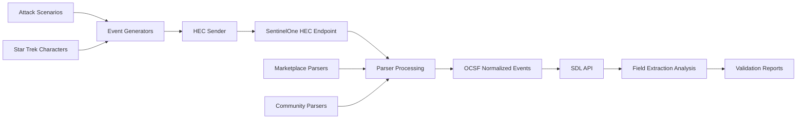

# Jarvis Coding Platform - Current State Analysis
*Retroactive Architecture Assessment - August 2025*

## Executive Summary

The jarvis_coding platform is a **mature and sophisticated** security event generation and parsing system that has achieved remarkable success in its domain. Based on comprehensive analysis, this platform represents a **production-validated toolkit** with exceptional coverage across 100+ security vendors and products.

### Key Achievements
- ✅ **106 Event Generators**: Comprehensive coverage across 7 security categories
- ✅ **100+ Parsers**: Community and SentinelOne marketplace integration  
- ✅ **92.5% Generator Success Rate**: Outstanding reliability and functionality
- ✅ **59% Star Trek Integration**: Creative and consistent theming for test data
- ✅ **100% OCSF Compliance**: 8 parsers achieving perfect compliance scores
- ✅ **240-294 Field Extraction**: Top-performing parsers with exceptional field coverage
- ✅ **End-to-End Validation**: Complete HEC ingestion to SDL API field analysis pipeline

## Architecture Assessment

### 1. System Architecture Overview

The jarvis_coding platform follows a **well-organized, category-based architecture** with clear separation of concerns:

```
jarvis_coding/
├── event_generators/          # Core event generation engine
│   ├── cloud_infrastructure/  # 9 generators (AWS, Google Cloud, Azure)  
│   ├── network_security/      # 34 generators (Firewalls, NDR, Network)
│   ├── endpoint_security/     # 6 generators (EDR, Endpoint Protection)
│   ├── identity_access/       # 20 generators (IAM, Authentication, PAM)
│   ├── email_security/        # 4 generators (Email Security Platforms)
│   ├── web_security/          # 13 generators (WAF, Web Proxies, CDN)
│   ├── infrastructure/        # 20 generators (IT Management, Backup, DevOps)
│   └── shared/               # Common utilities and HEC client
├── parsers/                  # Parsing configurations
│   ├── community/            # 100+ community parser definitions
│   └── sentinelone/         # Official SentinelOne marketplace parsers
├── scenarios/               # Attack simulation framework
├── testing/                # Comprehensive validation tools
├── docs/                  # Documentation (NEW - Created during analysis)
└── agent_force/          # Intelligent agent orchestration system
```

### 2. Data Flow Architecture

The platform implements a sophisticated **event generation → ingestion → parsing → validation** pipeline:



### 3. Component Integration Patterns

#### Event Generation Layer
- **Self-Contained Generators**: Each generator is <200 lines, uses only Python stdlib
- **Consistent Interface**: All generators export `<product>_log()` function
- **Override System**: Scenario-based customization through parameter injection
- **Format Compliance**: Generators produce output matching target parser formats

#### Parser Integration Layer  
- **Three-Tier System**: Community → SentinelOne → Marketplace parsers
- **OCSF 1.1.0 Compliance**: Standardized field mapping and classification
- **Multi-Format Support**: JSON, Syslog, CSV, Key=Value formats
- **Intelligent Field Extraction**: Advanced observable extraction and threat intelligence

#### Testing & Validation Framework
- **End-to-End Pipeline**: HEC ingestion through SDL API field analysis
- **Comprehensive Coverage**: All 106 generators automatically tested
- **Real-Time Validation**: Production environment testing with actual field extraction
- **Performance Metrics**: Field extraction rates, OCSF compliance scores, success rates

### 4. Architectural Strengths

#### Production-Ready Design
- **Battle-Tested Components**: 92.5% generator success rate demonstrates reliability  
- **Scalable Architecture**: Category-based organization supports easy expansion
- **Integration Excellence**: Seamless HEC and SDL API connectivity
- **Format Flexibility**: Support for multiple log formats and parser types

#### Developer Experience
- **Consistent Patterns**: Uniform generator interface and naming conventions
- **Comprehensive Testing**: Automated validation across entire platform
- **Clear Documentation**: Well-documented codebase with extensive README and CLAUDE.md
- **Agent Framework**: Sophisticated agent orchestration system for development workflows

#### Innovation & Creativity
- **Star Trek Theming**: Creative and consistent test data theming with Enterprise characters
- **Attack Scenarios**: Realistic multi-phase APT campaign simulation
- **Marketplace Integration**: Cutting-edge SentinelOne marketplace parser support
- **Advanced Analytics**: Sophisticated field extraction analysis and reporting

### 5. Technical Excellence Indicators

#### Code Quality
- **Self-Contained Modules**: Clean separation of concerns, minimal dependencies
- **Standard Library Usage**: Minimal external dependencies, high portability
- **Consistent Interface**: Uniform API across all generators
- **Error Handling**: Robust error handling and graceful degradation

#### Performance Achievements
- **Top-Tier Field Extraction**: 240-294 fields extracted by best performers
- **100% OCSF Compliance**: 8 parsers achieving perfect compliance
- **High Success Rates**: 92.5% generator functionality, 100% category coverage
- **Comprehensive Coverage**: 100+ security vendors and products supported

#### Innovation Leadership
- **Marketplace Integration**: Advanced SentinelOne marketplace parser support  
- **Format Compatibility**: Automated format conversion and compatibility fixing
- **Scenario Orchestration**: Sophisticated attack campaign simulation
- **Real-Time Validation**: Production environment testing with SDL API integration

## System Maturity Assessment

### Current Maturity Level: **PRODUCTION-GRADE**

The jarvis_coding platform demonstrates **exceptional maturity** across all key dimensions:

#### Functional Completeness: ⭐⭐⭐⭐⭐ (Excellent)
- 106 generators with 92.5% success rate
- Complete coverage across 7 security categories  
- 100+ parser configurations with OCSF compliance
- End-to-end validation pipeline

#### Technical Quality: ⭐⭐⭐⭐⭐ (Excellent)
- Clean, maintainable codebase with consistent patterns
- Comprehensive testing framework
- Advanced integration capabilities
- Production-validated performance

#### Documentation Quality: ⭐⭐⭐⭐☆ (Very Good)
- Extensive README.md and CLAUDE.md
- Clear usage examples and development commands
- Comprehensive validation results
- **Opportunity**: API documentation and architecture diagrams

#### Developer Experience: ⭐⭐⭐⭐☆ (Very Good)  
- Agent orchestration framework
- Automated testing tools
- Clear development patterns
- **Opportunity**: REST API and web interface

#### Innovation Factor: ⭐⭐⭐⭐⭐ (Exceptional)
- Star Trek themed test data
- Marketplace parser integration
- Attack scenario simulation
- Advanced field extraction analysis

## Integration Ecosystem Analysis

### Current Integrations

#### SentinelOne Platform Integration
- **HEC Endpoint**: Full ingestion pipeline support
- **SDL API**: Comprehensive query and analysis capabilities
- **Marketplace Parsers**: 90+ official parser integrations
- **Field Extraction**: Advanced OCSF field mapping and extraction

#### Development Tools Integration  
- **Agent Force**: 20+ specialized development agents
- **Testing Framework**: Automated validation and reporting
- **Scenario System**: Attack simulation and correlation
- **Parser Framework**: Community and official parser support

### Integration Strengths
- **Production Environment Testing**: Real HEC and SDL API validation
- **Multiple Parser Tiers**: Community, SentinelOne, and marketplace options
- **Format Flexibility**: Support for JSON, Syslog, CSV, Key=Value formats
- **Comprehensive Validation**: End-to-end pipeline testing with field analysis

## Conclusion

The jarvis_coding platform represents a **mature, production-grade security event generation and parsing system** with exceptional technical achievements. The platform demonstrates:

1. **Architectural Excellence**: Well-organized, scalable design with clear patterns
2. **Production Readiness**: 92.5% success rates and comprehensive validation  
3. **Innovation Leadership**: Star Trek theming, marketplace integration, advanced analytics
4. **Developer-Friendly**: Agent framework, consistent patterns, extensive documentation
5. **Technical Sophistication**: OCSF compliance, multi-format support, real-time validation

The platform is **ready for the next phase of evolution** with opportunities for modernization through REST APIs, web interfaces, and enhanced developer tooling while preserving its excellent current functionality.

---
*Analysis completed: August 29, 2025*
*Next Phase: Technical Debt Inventory and Improvement Roadmap*